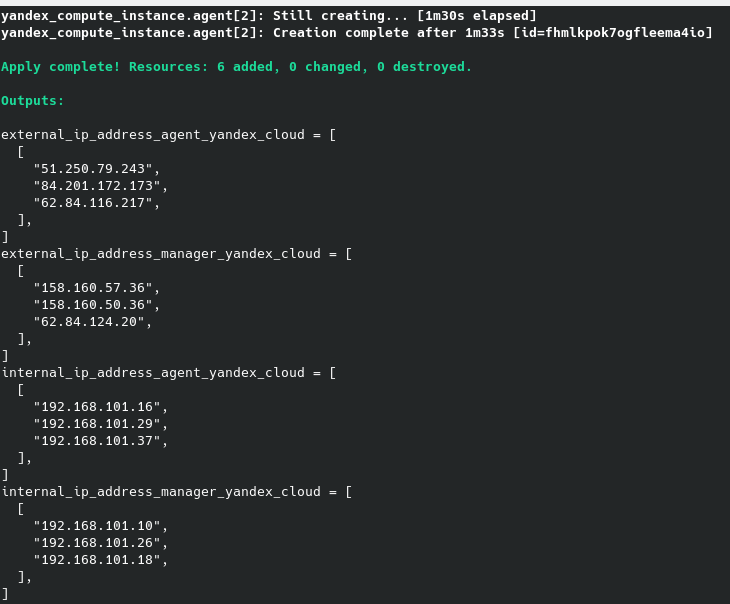
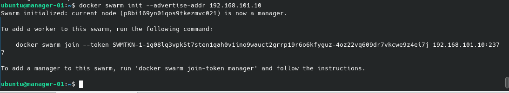
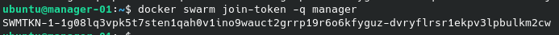
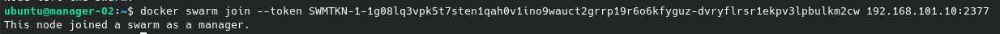
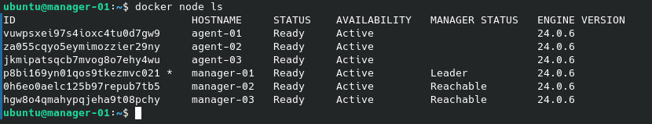

# Автор: Федорчук Дмитрий Сергеевич DEVOPS-33

# Домашнее задание к занятию 5. «Оркестрация кластером Docker контейнеров на примере Docker Swarm»

## Задача 1

Дайте письменные ответы на вопросы:

- В чём отличие режимов работы сервисов в Docker Swarm-кластере: replication и global?
- Какой алгоритм выбора лидера используется в Docker Swarm-кластере?
- Что такое Overlay Network?

## Решение 1

- В чём отличие режимов работы сервисов в Docker Swarm-кластере: replication и global?

В Docker Swarm используется два режима работы: Replicated service и Global service.

В режиме Global service строго один контейнер запускается на каждой ноде кластера. При добавлении новой ноды в кластер, планировщик Docker Swarm автоматически разместит контейнер на этой ноде.

В режиме Replicated service можно указывать сколько реплик контейнеров можно запускать на нодах кластера Docker Swarm. Сами ноды кластера указываются в конфигурации при планировании. Количество реплик можно увеличивать или уменьшать, в зависимости от выбранной стратегии планирования.

- Какой алгоритм выбора лидера используется в Docker Swarm-кластере?

В Docker Swarm алгоритм выбора лидер называется RAFT.
 
Суть принципа работы RAFT в том, что минимум две ноды кластера отправляют заявку на лидерство. Кто из них первый ответит, тот и становится лидером. Далее остальные ноды кластера отправляют запросы лидеру, чтобы проверить доступен ли он. Если лидер не ответил за указанное время, то снова повторяется процесс выбора лидера - кто первый ответит, тот и становится лидером.

- Что такое Overlay Network?

Docker Overlay Network это распределенная виртуальная сеть кластера Docker Swarm, которая необходима для сетевой связи между контейнерами, находящимися на разных нодах кластера. Есть возможности шифровать трафик между нодами Docker кластера. Маршрутизацией трафика между нодами кластера занимается компонент Docker Engine.

## Задача 2

Создайте ваш первый Docker Swarm-кластер в Яндекс Облаке.

Чтобы получить зачёт, предоставьте скриншот из терминала (консоли) с выводом команды:
```
docker node ls
```

## Решение 2

С помощью Packer создаю образ операционной системы Ubuntu 22.04 в Yandex Cloud. Используя Terraform, создам виртуальные машины на основе созданного ранее образа:



В итоге получаю 3 виртуальные машины, на которых будет развернут Docker Swarm Manager. И 3 виртуальные машины, на которых будет развернут Docker Swarm Agent.

Использую Ansible для установки Docker и Docker Compose на развернутые виртуальные машины.

На созданном хосте manager-01 выполню инициализацию Docker Swarm Manager:



Инициализация выполняется командой ```docker swarm init --advertise-addr <ip>```, где ip - ip адрес ноды, на которой инициализируется главный менеджер Docker Swarm кластера. 

Получаю сообщение об инициализации manager ноды и токен авторизации для подключения других worker нод.

Получаю токен для подключения manager нод:



Добавляю вторую и третью ноду менеджера и ноды агента в кластер:



Добавление нод в кластер выполняется командой ```docker swarm join --token <token> <ip:port>```, где ```token``` это токен авторизации manager или worker ноды, предложенный главным менеджером кластера при его инициализации, а ```ip:port``` это ip адрес главного менеджера кластера и порт, к которому осуществляется подключение.

После добавления всех manager и worker нод в Docker Swarm кластер проверю состояние кластера командой ```docker node ls```:



В итоге получаю 6 нод кластера, 3 из которых являются manager нодами, 3 agent ноды. Нода manager-01 является лидером, т.к. я именно на ней проводил инициализацию кластера.

## Задача 3

Создайте ваш первый, готовый к боевой эксплуатации кластер мониторинга, состоящий из стека микросервисов.

Чтобы получить зачёт, предоставьте скриншот из терминала (консоли), с выводом команды:
```
docker service ls
```
## Решение 3


## Задача 4 (*)

Выполните на лидере Docker Swarm-кластера команду, указанную ниже, и дайте письменное описание её функционала — что она делает и зачем нужна:
```
# см.документацию: https://docs.docker.com/engine/swarm/swarm_manager_locking/
docker swarm update --autolock=true
```


